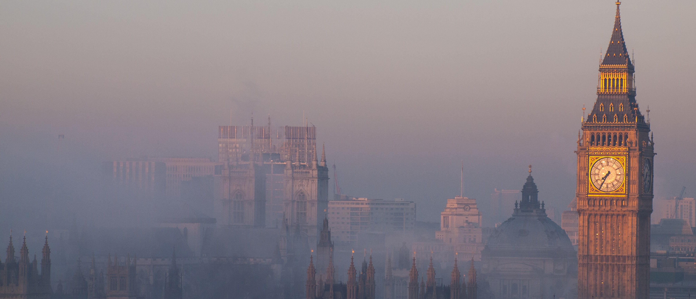
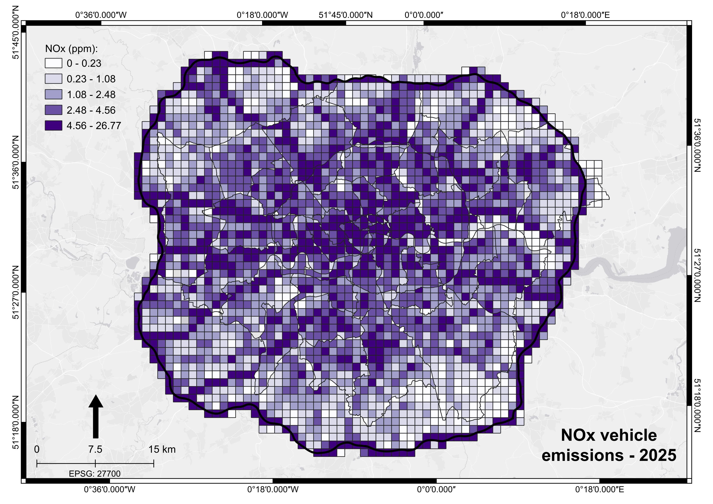
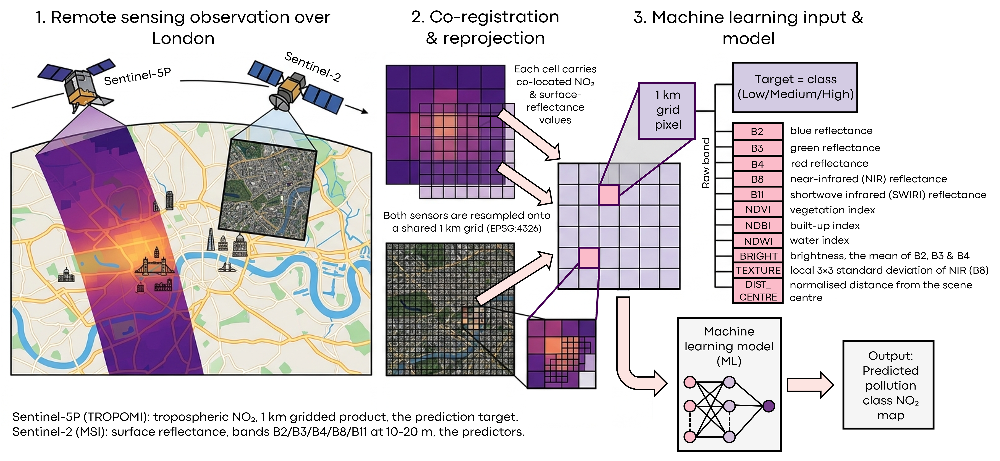
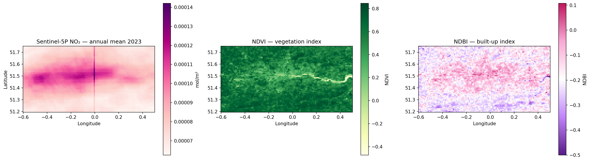
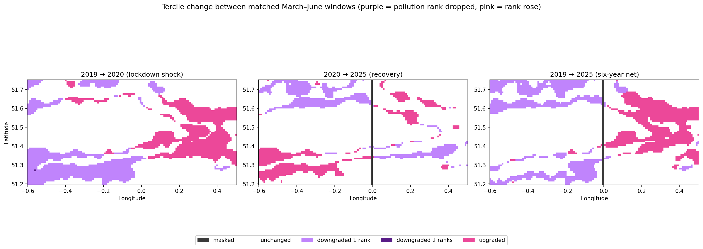
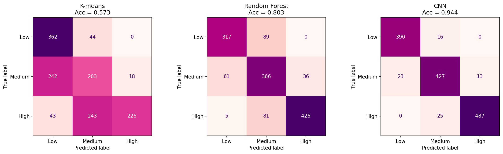
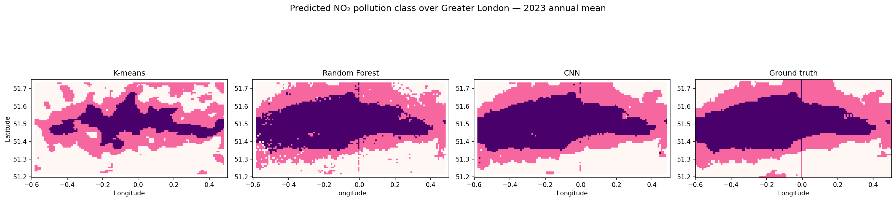
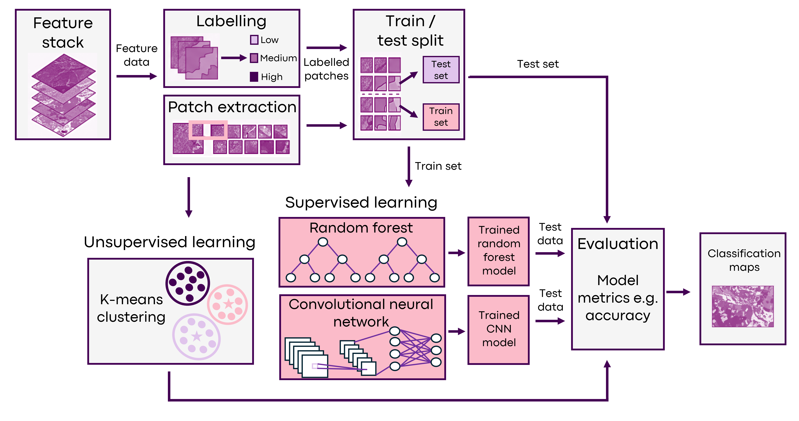
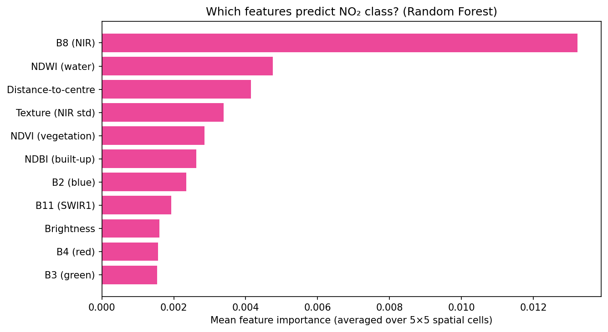
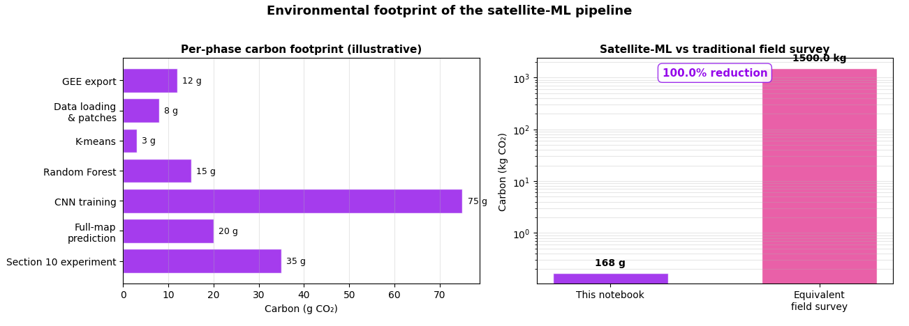

 

# Classifying Urban NO₂ Pollution Zones over Greater London

A comparison of three machine learning approaches (K-means, Random Forest and CNN) for classifying every 1 km x 1 km pixel over Greater London into low / medium / high tropospheric NO₂ pollution zones, using co-registered Sentinel-5P and Sentinel-2 imagery. This is then extended into a three-window natural experiment around the COVID-19 first national lockdown (March-June 2020) and the August 2023 ULEZ expansion, to test whether London's pollution landscape has reorganised.

## Table of contents

- [Problem statement](#problem-statement)
- [What this project does](#what-this-project-does)
- [Quick start](#quick-start)
- [Notebook structure](#notebook-structure)
- [Methodology highlights](#methodology-highlights)
- [Key findings](#key-findings)
- [Environmental cost](#environmental-cost)
- [Data sources](#data-sources)
- [Acknowledgements](#acknowledgements)
- [References](#references)

## Problem statement

### Background and motivation

Nitrogen dioxide (NO₂) is a major urban air pollutant, produced predominantly by road traffic and other combustion sources (Jarvis et al., 2010). Chronic exposure is linked to respiratory and cardiovascular disease, and NO₂ is a regulated pollutant under both UK and EU air-quality legislation. Conventional monitoring relies on a sparse network of ground stations, which provides accurate point measurements but cannot resolve the continuous spatial structure of pollution across a city.

***Figure 1**. Modelled road-traffic NOx emissions across Greater London (LAEI, 2025; tonnes per 1×1 km grid cell). Emissions concentrate sharply along the major road network, the spatial pattern this project aims to recover from satellite imagery. Map produced in QGIS from London Atmospheric Emissions Inventory data (Greater London Authority, 2025).*

Satellite remote sensing offers spatially complete coverage. The TROPOMI instrument aboard **Sentinel-5P** retrieves tropospheric NO₂ column density at roughly 1 km resolution using differential optical absorption spectroscopy (Veefkind et al., 2012; van Geffen et al., 2022). It has been used extensively to map urban pollution and to quantify emission changes e.g. the sharp NO₂ reductions observed over European cities during the 2020 COVID-19 lockdowns (Bauwens et al., 2020; Barré et al., 2021). NO₂ retrievals are however limited by coarse spatial resolution and by sensitivity to meteorology, whereas optical sensors such as **Sentinel-2** capture surface morphology (vegetation, built-up area, water and bare ground) at far higher resolution. This project uses the two sensors together, treating Sentinel-2 surface features as predictors for the Sentinel-5P NO₂ class.

***Figure 2**. Remote-sensing technique. (1) Two satellites observe Greater London: Sentinel-5P (TROPOMI) measures tropospheric NO₂ at coarse resolution, while Sentinel-2 (MSI) captures high-resolution optical surface reflectance. (2) Both products are co-registered and reprojected onto a shared 1 km grid (EPSG:4326), so every cell carries a co-located NO₂ value and matching surface-reflectance features. (3) For each grid cell, an 11-feature vector, five Sentinel-2 bands, four spectral indices and two locally-computed features is paired with an NO₂ pollution class (low/medium/high) and passed to the machine-learning models, which output a predicted pollution-class map for the whole scene.*

### Research question 1 - Can surface appearance predict pollution class?

The core task is to investigate how much of the spatial pattern of urban NO₂ is encoded in the appearance of the land surface. Every 1 km pixel over Greater London is classified into one of three NO₂ pollution tiers (**low / medium /high**), defined by the 33rd and 66th percentiles of the Sentinel-5P NO₂ field. The predictors are Sentinel-2 optical features, five raw bands plus four spectral indices (NDVI, NDBI, NDWI, brightness), and two locally-computed features (co-registered to the NO₂ grid).

Three machine-learning approaches are compared on this identical task:

- **K-means**: unsupervised clustering, a baseline that receives no labels.
- **Random Forest**: a supervised tree ensemble on flattened 5x5 feature patches (Belgiu & Drăguţ, 2016).
- **Convolutional Neural Network (CNN)**: a supervised deep model that exploits the spatial structure of the 5x5 patches.

This design directly contrasts **supervised vs. unsupervised** learning, and (at a 5x5 patch size) tests whether CNN's spatial inductive bias provides an advantage over a Random Forest for this task.

***Figure 3**. The data the project is built on. Left: Sentinel-5P tropospheric NO₂ (the prediction target), highest over inner London. Centre/right: two of the Sentinel-2 predictors, NDVI (vegetation) and NDBI (built-up area). The visible anti-correlation between vegetation and NO₂ is the signal the models exploit.*

### Research question 2 - How has London's NO₂ pattern changed over time?

The second part of the project reuses the trained models across three matched March–June windows: **2019** (pre-pandemic), **2020** (the UK's first national lockdown), and **2025** (post-pandemic, post-ULEZ-expansion). Aligning the windows to the same calendar dates controls for the strong seasonal cycle in NO₂ (Beirle et al., 2011), following standard practice in the COVID-NO₂ literature (Goldberg et al., 2020). The three comparisons isolate three distinct effects including the lockdown shock, the post-pandemic recovery and the longer-term influence of the August 2023 expansion of London's Ultra Low Emission Zone. The ERA5-Land reanalysis data (Muñoz-Sabater et al., 2021) provides a meteorological sanity check.

***Figure 4**. Tercile change between matched windows: purple = pollution rank fell, pink = rose. The 2019 → 2020 lockdown shock and the 2020 → 2025 recovery are both visible and the six-year net panel shows a east-west split across London.*

### Why this matters

This project assigns a pollution class to every square kilometre of the city, turning a sparse point network into a continuous map. 

This matters for two reasons:

* If surface appearance alone can recover the NO₂ pattern, then optical imagery (which is higher-resolution, more frequent, and less meteorologically sensitive than the NO₂ retrieval itself) could help downscale or gap-fill coarse 1 km TROPOMI data. The K-means baseline sets the bar for how much of that signal is available without labels; the gap up to the supervised models measures what actually requires learning.
* A classifier that wins on 2023 data is of little operational use for year-on-year monitoring if it collapses on 2019 or 2025. By retraining nothing and applying the 2023 models to other years, the project shows that the highest-accuracy model is not necessarily the right operational choice, a result with correlation on how EO monitoring systems should be built and validated.

[Back to top](#table-of-contents)

## What this project does

1. Pulls Sentinel-5P tropospheric NO₂ and Sentinel-2 surface reflectance through Google Earth Engine, co-registers them onto a common 1 km grid and exports an 11-band feature stack covering Greater London and the commuter belt.
2. Builds a label raster by binning the NO₂ field into terciles (low / medium / high), then extracts 5x5x11 patches around every labelled pixel.
3. Trains three classifiers: K-means (unsupervised), Random Forest (classical supervised), and CNN (deep supervised) on identical patch data and compares them with 5-fold cross-validation, hyperparameter ablation and multi-seed variance estimates.
4. Applies all three models to the full London scene and produces error maps showing where each model fails geographically.
5. Extends the pipeline to a three-window natural experiment (2019 / 2020 / 2025), tests model generalisation across periods and runs a spatial-block permutation test on whether pixels inside the pre-2023 ULEZ boundary were significantly more likely to be downgraded over the six-year window.
6. Tracks the environmental cost of the whole run and a phase-level tracker, comparing the satellite-ML footprint to an equivalent field-survey baseline.

***Figure 5**. Test-set confusion matrices for the three models: K-means (0.573), Random Forest (0.803) and CNN (0.944). Medium is the hardest class for all three; the supervised models keep their errors one class away, with no Low ↔ High confusion.*

[Back to top](#table-of-contents)

## Quick start

The notebook is designed to run end-to-end on Google Colab. All Sentinel-5P and Sentinel-2 data is pulled through Google Earth Engine, so a registered GEE account is the only hard prerequisite.

### Prerequisites

- A Google account with [Earth Engine access](https://earthengine.google.com) (free for non-commercial use)
- A Google Cloud project registered with Earth Engine
- Approximately 500 MB of free space in your Google Drive for the exported GeoTIFFs

### Running the notebook

1. Open `notebook.ipynb` in Google Colab.
2. Run Section 1, this installs dependencies and authenticates Earth Engine. When prompted, paste your own GCP project ID into the `ee.Initialize(project=...)` call in Section 1.
3. Run Section 3 to trigger the GEE export. This is the slow step (2-5 minutes); track progress at [code.earthengine.google.com](https://code.earthengine.google.com) under the Tasks tab.
4. Once the export task completes, the GeoTIFF will appear in your Drive at `AI4EO_assignment_training/london_stack_2023.tif`.
5. Sections 4 through 9 run locally on the loaded GeoTIFF with no further GEE calls.
6. Section 10 triggers three more GEE exports (one per matched window) and runs identically once they complete.

A full run end-to-end is approximately 25 minutes of wall time, dominated mainly by the GEE exports and CNN training.

[Back to top](#table-of-contents)

## Notebook structure

The notebook is organised into 12 sections, each self-contained enough to be run from a fresh kernel given the outputs of the previous section.

| Section | What it does |
|---|---|
| 1. Setup | Installs dependencies, mounts Drive, sets up the environmental cost tracker, authenticates GEE |
| 2. Study region | Defines the 75 x 60 km bounding box covering Greater London + commuter belt |
| 3. Data fetching | Pulls Sentinel-5P NO₂ and Sentinel-2 reflectance, co-registers, exports GeoTIFF |
| 4. Load and inspect | Reads the GeoTIFF, applies a 3x3 median filter to suppress the S5P swath artefact |
| 5. Build labels | Bins NO₂ into terciles to produce a three-class label raster |
| 6. Patch extraction | Builds 5x5x11 patches with engineered features (texture, distance-from-centre) |
| 7. Model training | Trains K-means, Random Forest, and a small CNN on identical data |
| 8. Evaluation | Confusion matrices, 5-fold CV, feature importance, hyperparameter ablation, multi-seed variance |
| 9. Full-scene application | Predicts every pixel with all three models, produces error and disagreement maps |
| 10. Three-window experiment | 2019 / 2020 / 2025 comparison, ERA5 weather check, ULEZ chi-squared test |
| 11. Summary | Consolidated findings |
| 12. Environmental cost | Energy and CO₂ footprint with field-survey comparison |

For more details on the the different sections of the code please see the video below:

 add link to video

[Back to top](#table-of-contents)

## Methodology highlights

* **The task is spatial pattern recovery, not pollution forecasting**: Labels are derived from the same Sentinel-5P NO₂ field that the model is asked to predict (tercile bins of that field). This means the question is *how much of the NO₂ spatial pattern is encoded in surface morphology*, not *can we predict pollution from independent ground truth*. The accuracy ceiling is in principle below 100% because surface appearance does not carry all the relevant atmospheric information. This caveat is flagged explicitly at the top of Section 5 and propagates through every downstream interpretation.

***Figure 6**. All three models applied to the full London scene, against ground truth. K-means recovers only the broad core; Random Forest and CNN both reproduce the spatial pattern closely, with the CNN's output the smoothest and closest to truth.*

* **Per-period tercile labelling for the three-window experiment**: In Section 10, each of the three windows (2019, 2020, 2025) is independently re-binned into its own terciles rather than applying 2023 boundaries to all three. This reframes the analysis around *spatial reorganisation* rather than absolute concentration, which preserves rank ordering and therefore preserves tercile boundaries from TROPOMI processor-version drift between 2019 (v1) and 2025 (v2). 

* **Why 5x5 patches, not 3x3**: A 3x3 patch with a same-padded 3x3 convolution kernel collapses the CNN to essentially a multilayer perceptron, because the kernel already sees the entire patch on the first layer and there is no spatial hierarchy left for deeper layers to exploit (attempted in the first draft). 5x5 patches let two stacked conv blocks build a spatial hierarchy. 5 km x 5 km at 1 km resolution is also the right scale for NO₂ patterns shaped by road networks and atmospheric dispersion.

* **Multi-seed evaluation**: Section 8.5 retrains all three models with five different random seeds and reports mean ± standard deviation of test accuracy. Single-seed point estimates are noisy (CNN accuracy in particular can wobble by ±2 percentage points across initialisations). A headline gap of 1 percentage point between two models with that level of variance is not evidence one is better than the other. Across five seeds the spread is small (±0.001-0.002) relative to the inter-model gaps, so the K-means / RF / CNN ranking is not an artefact of a lucky initialisation.

***Figure 7**. Machine learning workflow from the 11-band feature stack to classification maps: tercile labelling, 5x5 patch extraction, an 80/20 split, three classifiers (K-means unsupervised; Random Forest and CNN supervised) and evaluation on test patches.*

[Back to top](#table-of-contents)

## Key findings

More detailed discussion can be found in Section 10.9 and 11 in the note book, the two research questions are summarised here.

### Research question 1 - can surface appearance predict pollution class?

Surface appearance can indeed predict pollution class with supervised learning. K-means, with no labels, reaches only 0.57 accuracy, it recovers the low-pollution class but collapses medium and high together. Both supervised models do substantially better: Random Forest at 0.80 and the CNN at 0.93. The supervised models also keep their errors one class away, with no Low ↔ High confusion. The CNN's margin over the Random Forest is larger than the seed-to-seed variance, which means spatial context (the thing only the CNN can exploit at a 5x5 patch) carries a meaningful signal for this task. Feature importance is led by near-infrared reflectance (B8), which separates vegetated from built-up surfaces, with the engineered distance-to-centre feature also ranking highly, consistent with pollution following surface type and a roughly radial gradient from the city core.

***Figure 8**. Random Forest feature importance, averaged over the 5×5 patch cells. Near-infrared reflectance (B8) is by far the strongest predictor of NO₂ class, NIR sharply separates vegetated from built-up surfaces. The Distance-to-centre feature also ranks highly, reflecting London's roughly radial pollution gradient, while the visible bands (red, green, blue) contribute least.*

### Research question 2 - how has London's NO₂ pattern changed?

The three-window experiment recovers the expected lockdown drop in 2019 → 2020 confirming less NO₂ pollution during this time frame. The six year 2019 → 2025 comparison shows an uneven change where NO₂ fell substantially across western and central London, while eastern London saw little improvement or a slight increase. The decline is therefore geographically concentrated rather than city-wide. The most important methodological finding is that **the model ranking flips** as the CNN wins in 2023 but the Random Forest generalises better to every other year (0.65 vs 0.59 in 2019, 0.71 vs 0.68 in 2020, 0.70 vs 0.67 in 2025), because the CNN's extra capacity overfit to 2023-specific patterns. For year-on-year monitoring with a fixed model, the simpler Random Forest is the safer operational choice.

## Limitations

More detailed limitations are in Section 10.9 notebook.

- **Weather is not fully controlled in the three-window comparison**: Section 10.4 uses ERA5-Land wind and temperature to bound the confound but does not apply a statistical detrending. Differences below the 10% threshold are absorbed into the headline numbers without correction.
- **TROPOMI processor versions vary across the three windows**: The v1 → v2 transition introduces a 10-20% step change in retrieved column densities. Per-period tercile labelling (Section 10.5) absorbs this for the spatial-reorganisation analysis, but rules out direct absolute-concentration comparison.
- **Errors are not spread evenly across the map**: Section 9.1's error maps show the mistakes cluster along the urban edge, where the tercile boundary between pollution classes is inherently fuzzy, not randomly across the scene.

[Back to top](#table-of-contents)

## Environmental cost

The notebook is instrumented to measure the environmental cost at Section 12. 

### How it is tracked

The tracker is initiated in Section 1:

- **A phase-level tracker**: a lightweight class that wraps each major stage (GEE export, data loading, K-means, Random Forest training, CNN training, full-scene prediction, and the Section 10 experiment) and logs wall time, CPU load, estimated power draw, and the resulting CO₂eq per phase. Showing where the compute budget is actually spent, not just the total.

***Figure 9**. Environmental cost of the project. Left: per-phase carbon footprint logged by the in-notebook tracker, CNN training dominates at 75 g, far above the classical models and data handling. Right: the full pipeline (168 g CO₂) against an estimated equivalent ground-based field survey (1,500 kg CO₂), shown on a log scale, a reduction of roughly four orders of magnitude, driven almost entirely by the absence of vehicle travel.*

The tracker assumes a baseline system power draw of 75 W scaled by measured CPU load, and converts energy to emissions with a configurable grid factor (0.5 kg CO₂eq/kWh by default, broadly representative of the UK grid). Both numbers are documented in the code so they can be adjusted for a different run environment.

### What the run costs

A typical end-to-end run produces on the order of **168 g CO₂eq**, depending on hardware and grid intensity. The phase breakdown in Section 12 consistently shows that **CNN training dominates** the budget, with the GEE exports and the Section 10 three-window experiment as secondary contributors, and classical ML (K-means, Random Forest) and data I/O comparatively negligible. This is the expected profile for a deep-learning EO workflow and points to model training as the obvious target for any efficiency optimisation.

### Comparison with a field survey

To put Figure 9 in context, Section 12 compares it against an equivalent ground-based monitoring campaign (the alternative for characterising NO₂ across an area this size). A field survey covering Greater London would involve vehicle travel between sites, instrument deploymen, and repeated visits; a conservative estimate places this three to four orders of magnitude above the notebook's footprint, driven almost entirely by transport emissions.

This notebook is therefore a **reduction of roughly 1,000x** vs field-based monitoring. The absolute CO₂eq figure (Figure 9) however is good only to within a factor of two (power-draw and grid-intensity assumptions are approximate), as satellite retrieval and ground monitoring measure are related but are not identical quantities.

[Back to top](#table-of-contents)

## Data sources

- **Sentinel-5P TROPOMI** offline-reprocessed L3 NO₂: `COPERNICUS/S5P/OFFL/L3_NO2` (via Google Earth Engine)
- **Sentinel-2 MSI** surface reflectance harmonised: `COPERNICUS/S2_SR_HARMONIZED` (via Google Earth Engine)
- **ERA5-Land** hourly reanalysis: `ECMWF/ERA5_LAND/HOURLY` (via Google Earth Engine), used for the weather sanity check in Section 10.4
- **ULEZ boundary**: from Transport for London's published pre-2023 ULEZ map

## Acknowledgements

This project was completed for GEOL0069 (Artificial Intelligence for Earth Observation) at UCL taught by Dr Michel Tsamados with supervisors Weibin Chen and Shambhu Bhandari Sharma. The patch-extraction, classification and evaluation workflow builds on material and template code from the GEOL0069 course (weeks 2-4 and 9).

## References

- Barré, J., Petetin, H., Colette, A., Guevara, M., Peuch, V.-H., Rouïl, L., Engelen, R., Inness, A., Flemming, J., Pérez García-Pando, C., Bowdalo, D., Meleux, F., Geels, C., Christensen, J.H., Gauss, M., Benedictow, A., Tsyro, S., Friese, E., Struzewska, J., Kaminski, J.W., Douros, J., Timmermans, R., Robertson, L., Adani, M., Jorba, O., Joly, M. and Kouznetsov, R. (2021) 'Estimating lockdown-induced European NO₂ changes using satellite and surface observations and air quality models', Atmospheric Chemistry and Physics, 21(9), pp. 7373–7394. [https://doi.org/10.5194/acp-21-7373-2021]

- Bauwens, M., Compernolle, S., Stavrakou, T., Müller, J.-F., van Gent, J., Eskes, H., Levelt, P.F., van der A, R., Veefkind, J.P., Vlietinck, J., Yu, H. and Zehner, C. (2020) 'Impact of coronavirus outbreak on NO₂ pollution assessed using TROPOMI and OMI observations', Geophysical Research Letters, 47(11), e2020GL087978. [https://doi.org/10.1029/2020GL087978][https://doi.org/10.1029/2020GL087978]

- Beirle, S., Boersma, K.F., Platt, U., Lawrence, M.G. and Wagner, T. (2011) 'Megacity emissions and lifetimes of nitrogen oxides probed from space', Science, 333(6050), pp. 1737–1739. [https://doi.org/10.1126/science.1207824]

- Belgiu, M. and Drăguţ, L. (2016) 'Random forest in remote sensing: a review of applications and future directions', ISPRS Journal of Photogrammetry and Remote Sensing, 114, pp. 24–31. [https://doi.org/10.1016/j.isprsjprs.2016.01.011]

- Cooper, M.J., Martin, R.V., Hammer, M.S., Levelt, P.F., Veefkind, P., Lamsal, L.N., Krotkov, N.A., Brook, J.R. and McLinden, C.A. (2022) 'Global fine-scale changes in ambient NO₂ during COVID-19 lockdowns', Nature, 601(7893), pp. 380–387. [https://doi.org/10.1038/s41586-021-04229-0]

- Eskes, H., van Geffen, J., Boersma, F., Eichmann, K.-U., Apituley, A., Pedergnana, M., Sneep, M., Veefkind, J.P. and Loyola, D. (2023) Sentinel-5 Precursor / TROPOMI Level 2 Product User Manual: Nitrogen Dioxide. Document S5P-KNMI-L2-0021-MA. De Bilt: Royal Netherlands Meteorological Institute (KNMI). [https://doi.org/10.5194/gmd-16-509-2023]

- Goldberg, D.L., Anenberg, S.C., Griffin, D., McLinden, C.A., Lu, Z. and Streets, D.G. (2020) 'Disentangling the impact of the COVID-19 lockdowns on urban NO₂ from natural variability', Geophysical Research Letters, 47(17), e2020GL089269. [https://doi.org/10.1029/2020GL089269]

- Greater London Authority (2023) London-wide ULEZ expansion. Mayor of London policy briefing, August. London: Greater London Authority. Available at: [https://www.london.gov.uk/Ultra%20Low%20Emission%20Zone%20expands%20London-wide%20in%20a%20landmark%20moment%20for%20the%20capital]

- Greater London Authority (2025) London Atmospheric Emissions Inventory (LAEI) 2019. London Datastore. Available at: [https://data.london.gov.uk/dataset/london-atmospheric-emissions-inventory-laei-2019-e758q]

- Jarvis, D.J., Adamkiewicz, G., Héroux, M.-E., Rapp, R. and Kelly, F.J. (2010) 'Nitrogen dioxide', in WHO Guidelines for Indoor Air Quality: Selected Pollutants. Geneva: World Health Organization. [https://www.ncbi.nlm.nih.gov/books/NBK138707/]

- Liu, F., Page, A., Strode, S.A., Yoshida, Y., Choi, S., Zheng, B., Lamsal, L.N., Li, C., Krotkov, N.A., Eskes, H., van der A, R., Veefkind, P., Levelt, P.F., Hauser, O.P. and Joiner, J. (2021) 'Abrupt decline in tropospheric nitrogen dioxide over China after the outbreak of COVID-19', Science Advances, 6(28), eabc2992. [https://doi.org/10.1126/sciadv.abc2992]

- Lorente, A., Boersma, K.F., Eskes, H.J., Veefkind, J.P., van Geffen, J.H.G.M., de Zeeuw, M.B., Denier van der Gon, H.A.C., Beirle, S. and Krol, M.C. (2019) 'Quantification of nitrogen oxides emissions from build-up of pollution over Paris with TROPOMI', Scientific Reports, 9(1), 20033. [https://doi.org/10.1038/s41598-019-56428-5]

- Muñoz-Sabater, J., Dutra, E., Agustí-Panareda, A., Albergel, C., Arduini, G., Balsamo, G., Boussetta, S., Choulga, M., Harrigan, S., Hersbach, H., Martens, B., Miralles, D.G., Piles, M., Rodríguez-Fernández, N.J., Zsoter, E., Buontempo, C. and Thépaut, J.-N. (2021) 'ERA5-Land: a state-of-the-art global reanalysis dataset for land applications', Earth System Science Data, 13(9), pp. 4349–4383. [https://doi.org/10.5194/essd-13-4349-2021]

- Robson, M. (2019) [London]. Licensed under CC BY-SA 3.0. Available at: [https://www.saferworld-global.org/resources/news-and-analysis/post/847-putting-peace-first-six-priorities-for-a-2019-uk-general-election]

- van Geffen, J., Eskes, H., Compernolle, S., Pinardi, G., Verhoelst, T., Lambert, J.-C., Sneep, M., ter Linden, M., Ludewig, A., Boersma, K.F. and Veefkind, J.P. (2022) 'Sentinel-5P TROPOMI NO₂ retrieval: impact of version v2.2 improvements and comparisons with OMI and ground-based data', Atmospheric Measurement Techniques, 15(7), pp. 2037–2060. [https://doi.org/10.5194/amt-15-2037-2022]

- Veefkind, J.P., Aben, I., McMullan, K., Förster, H., de Vries, J., Otter, G., Claas, J., Eskes, H.J., de Haan, J.F., Kleipool, Q., van Weele, M., Hasekamp, O., Hoogeveen, R., Landgraf, J., Snel, R., Tol, P., Ingmann, P., Voors, R., Kruizinga, B., Vink, R., Visser, H. and Levelt, P.F. (2012) 'TROPOMI on the ESA Sentinel-5 Precursor: a GMES mission for global observations of the atmospheric composition for climate, air quality and ozone layer applications', Remote Sensing of Environment, 120, pp. 70–83. [https://doi.org/10.1016/j.rse.2011.09.027]

[Back to top](#table-of-contents)
